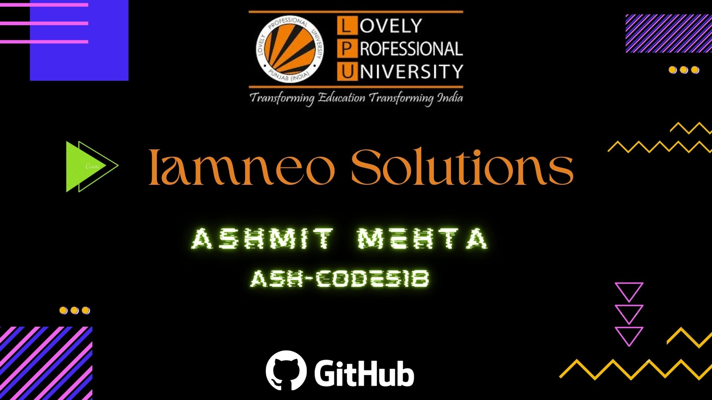

# LPU Colab CPP and DSA Solutions

This repository contains solutions to the coding problems of the CPP (CSE-202) and DSA (CSE-205) courses on the LPU Colab platform.

## About

This repository is a compilation of solutions developed by Ashmit Mehta (GitHub: [ash-codes18](https://github.com/ash-codes18)) for the CPP and DSA courses at Lovely Professional University (LPU) through the LPU Colab platform. The solutions provided here are intended to assist students in understanding and solving the coding problems assigned in the courses.

## Courses Covered

- CPP (CSE-202): This section contains solutions related to the programming problems from the CPP course. These solutions are organized according to the topics covered in the course curriculum.

- DSA (CSE-205): In this section, you will find solutions to various data structures and algorithms problems assigned as part of the DSA course. These solutions are categorized based on the specific data structures and algorithms they address.

## Repository Structure

The repository is organized as follows:

/ 
├── CPP/ 
│ ├── Unit-1/ 
│ │ ├── Lecture-1/ 
│ │ ├── Lecture-2/ 
│ │ └── ... 
│ ├── Unit-2/ 
│ └── ... 
├── DSA/ 
│ ├── Unit-1/ 
│ │ ├── Lecture-1/ 
│ │ ├── Lecture-2/ 
│ │ └── ... 
│ ├── Unit-3 
│ ├── Unit-2 
│ └── ... 
├── README.md 
└── ... 

Feel free to explore the folders and navigate to the respective problem solutions.

## Usage

You can use the solutions provided here as a reference to understand how to approach and solve coding problems related to CPP and DSA. However, it is essential to acknowledge that using these solutions as-is for academic submissions would violate the academic integrity policy of your institution. It's recommended to use these solutions to enhance your understanding and problem-solving skills.

## Contribution

Contributions to this repository are welcome! If you have alternative solutions, improvements, or suggestions for the existing solutions, please feel free to create a pull request. Please ensure that your contributions align with the academic integrity guidelines of your institution.

## Contact

If you have any questions, suggestions, or just want to connect, you can reach out to Ashmit Mehta:

- GitHub: [ash-codes18](https://github.com/ash-codes18)
- LinkedIn: [Ashmit Mehta](https://www.linkedin.com/in/ashmit-mehta/)

Do consider leaving a star⭐ if you liked the repo! 
Happy coding! 

